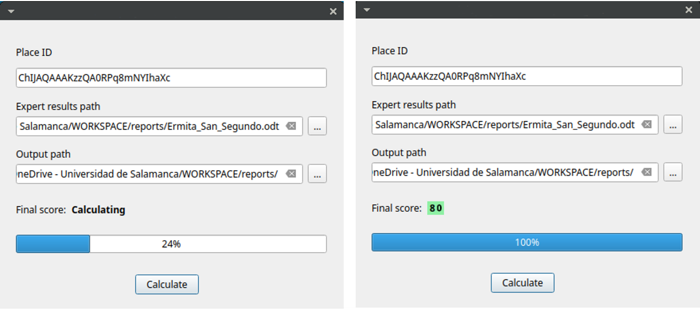

# TERRITAGE-DATA – Open Data Repository

## Overview

This repository contains datasets, software, digital resources and supplementary materials developed within the research project:

**Digital Technology and Territorial Heritage: A holistic approach for the valorization of demographically depressed rural areas (TERRITAGE-DATA)**

**Grant Reference**: CNS2023-144126
**Principal Investigator**: Miguel Ángel Maté González

The project focuses on the development of innovative methodologies based on Geomatics, Geographic Information Systems (GIS), Artificial Intelligence (AI), 3D digitization and Digital Twins for the documentation, analysis, monitoring and valorisation of territorial cultural heritage, particularly in rural areas affected by depopulation.

https://territagedata.usal.es/

## Repository Content

This repository provides a Python application for the automated assessment and monitoring of cultural heritage assets by combining expert evaluation with AI-assisted analysis of Google Reviews.

The application automatically retrieves public Google Reviews associated with a heritage asset, analyses visitor opinions using Large Language Models (LLMs), integrates these results with an expert technical assessment, and generates:

- an overall heritage assessment;
- a traffic-light indicator (Green / Yellow / Red);
- automated trend analysis;
- an early-warning system for changes in visitor perception;
- individual technical reports.

## Main Features

- Retrieval of Google Reviews using Google Place IDs.
- Automatic extraction of ratings and textual reviews.
- AI-assisted semantic analysis using Large Language Models.
- Integration of expert technical assessment and visitor perception.
- Automatic calculation of an overall heritage score.
- Heritage traffic-light classification (Green / Yellow / Red).
- Temporal monitoring of visitor perception.
- Automatic generation of Word reports.
- Export of graphs and analytical results.

## Workflow

The application follows four main stages:

1. Import the expert technical assessment.
2. Retrieve Google Reviews for the selected heritage asset.
3. Analyse visitor opinions using an LLM.
4. Generate the final assessment, traffic-light classification, temporal trends and automated report.

## Contributors

The development of this repository involved:

Miguel Ángel Maté-González
Jesús Rodríguez-Hernández
Daniel Herranz Herranz
Fernando Peral Fernández
Silvia Díaz-de la Fuente
Cristina Sáez Blázquez
Diego González-Aguilera

## Funding

This work was developed within the research project:

Digital Technology and Territorial Heritage: A holistic approach for the valorization of demographically depressed rural areas (TERRITAGE-DATA) (CNS2023-144126)

Funded by the Spanish Ministry of Science, Innovation and Universities through the State Research Agency (AEI), co-funded by the European Union – NextGenerationEU/PRTR, under the Consolidación Investigadora 2023 programme (Grant CNS2023-144126).
